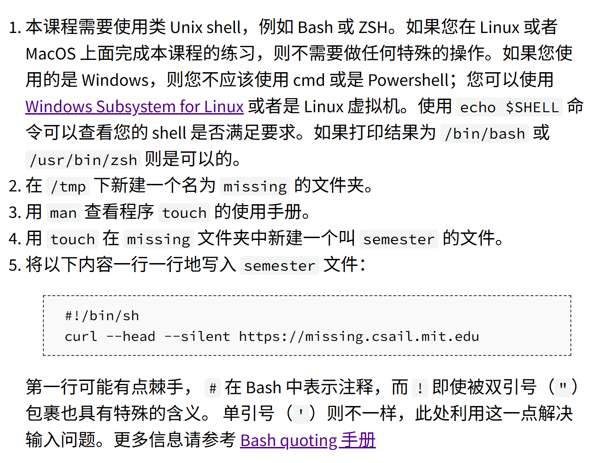
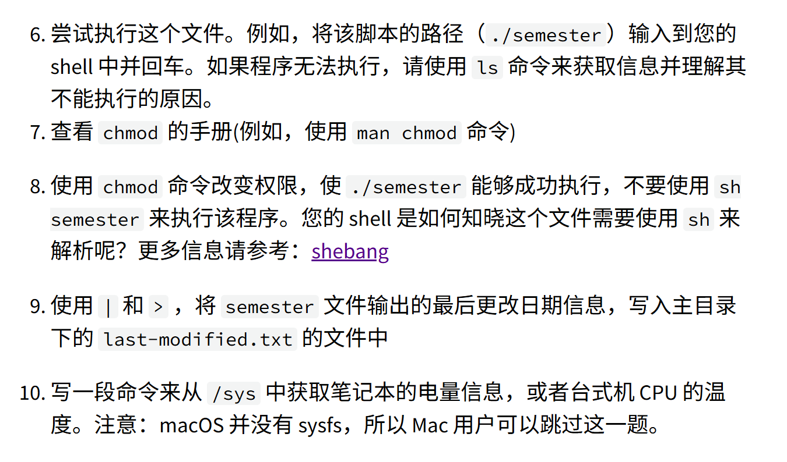

```bash
(base) tipsy@tipsyscholar:~$ echo $SHELL
/bin/bash
(base) tipsy@tipsyscholar:~$ cd /tmp
(base) tipsy@tipsyscholar:/tmp$ mkdir missing
(base) tipsy@tipsyscholar:/tmp$ man touch
(base) tipsy@tipsyscholar:/tmp$ cd missing/
(base) tipsy@tipsyscholar:/tmp/missing$ touch semester
(base) tipsy@tipsyscholar:/tmp/missing$ echo '#!/bin/sh' > semester
(base) tipsy@tipsyscholar:/tmp/missing$ echo 'curl --head --silent https://missing.csail.mit.edu' >> semester
(base) tipsy@tipsyscholar:/tmp/missing$ cat semester
#!/bin/sh
curl --head --silent https://missing.csail.mit.edu
(base) tipsy@tipsyscholar:/tmp/missing$
```

```bash
(base) tipsy@tipsyscholar:/tmp/missing$ ./semester
-bash: ./semester: Permission denied
(base) tipsy@tipsyscholar:/tmp/missing$ ls -l
total 4
-rw-r--r-- 1 tipsy tipsy 61 Nov 30 00:40 semester
(base) tipsy@tipsyscholar:/tmp/missing$ #没有执行权限(x)
(base) tipsy@tipsyscholar:/tmp/missing$ man chmod
(base) tipsy@tipsyscholar:/tmp/missing$ chmod u+x semester
(base) tipsy@tipsyscholar:/tmp/missing$ ./semester
HTTP/1.1 200 Connection established

HTTP/2 200
server: GitHub.com
content-type: text/html; charset=utf-8
last-modified: Thu, 28 Aug 2025 13:37:00 GMT
access-control-allow-origin: *
etag: "68b05b7c-2002"
expires: Sat, 29 Nov 2025 17:06:54 GMT
cache-control: max-age=600
x-proxy-cache: MISS
x-github-request-id: 0D82:69F7A:269336:2AEE69:692B25D4
accept-ranges: bytes
age: 0
date: Sat, 29 Nov 2025 16:56:54 GMT
via: 1.1 varnish
x-served-by: cache-hkg17933-HKG
x-cache: MISS
x-cache-hits: 0
x-timer: S1764435414.068181,VS0,VE276
vary: Accept-Encoding
x-fastly-request-id: d5becb5738e361a43c2170d39633a1bc3cdb9630
content-length: 8194

(base) tipsy@tipsyscholar:/tmp/missing$ ./semester | grep -i 'last-modified' > ~/last-modified.txt
(base) tipsy@tipsyscholar:/tmp/missing$ cat ~/last-modified.txt
last-modified: Thu, 28 Aug 2025 13:37:00 GMT
(base) tipsy@tipsyscholar:/tmp/missing$ cd /sys
(base) tipsy@tipsyscholar:/sys$ ls
block  bus  class  dev  devices  firmware  fs  hypervisor  kernel  module  power
(base) tipsy@tipsyscholar:/sys/class$ ls
ata_device   devlink          hwmon             mdio_bus        power_supply    sas_expander   thermal
ata_link     dma              input             mem             powercap        sas_host       tpm
ata_port     drm              intel_scu_ipc     misc            ppp             sas_phy        tpmrm
backlight    fc_host          iommu             nd              pps             sas_port       tty
bdi          fc_remote_ports  iscsi_connection  net             ptp             scsi_device    vc
block        fc_transport     iscsi_endpoint    nvme            pwm             scsi_disk      virtio-ports
bsg          fc_vports        iscsi_host        nvme-generic    raid_devices    scsi_generic   vtconsole
dca          firmware         iscsi_iface       nvme-subsystem  rtc             scsi_host      wakeup
devcoredump  gpio             iscsi_session     pci_bus         sas_device      spi_host       watchdog
devfreq      graphics         iscsi_transport   phy             sas_end_device  spi_transport
(base) tipsy@tipsyscholar:/sys/class$ cd power_supply/
(base) tipsy@tipsyscholar:/sys/class/power_supply$ find -L /sys/class/power_supply/ -maxdepth 2 \( -name '*power*
' -o -name '*energy*' -o -name '*capacity*' \)
/sys/class/power_supply/
/sys/class/power_supply/BAT1/power_now
/sys/class/power_supply/BAT1/power
/sys/class/power_supply/BAT1/energy_now
/sys/class/power_supply/BAT1/capacity
find: File system loop detected; ‘/sys/class/power_supply/BAT1/subsystem’ is part of the same file system loop as ‘/sys/class/power_supply/’.
/sys/class/power_supply/BAT1/capacity_level
/sys/class/power_supply/BAT1/energy_full_design
/sys/class/power_supply/BAT1/energy_full
/sys/class/power_supply/AC1/power
find: File system loop detected; ‘/sys/class/power_supply/AC1/subsystem’ is part of the same file system loop as ‘/sys/class/power_supply/’.
(base) tipsy@tipsyscholar:/sys/class/power_supply$ cat /sys/class/power_supply/BAT1/capacity
99
(base) tipsy@tipsyscholar:/sys/class/power_supply$
```