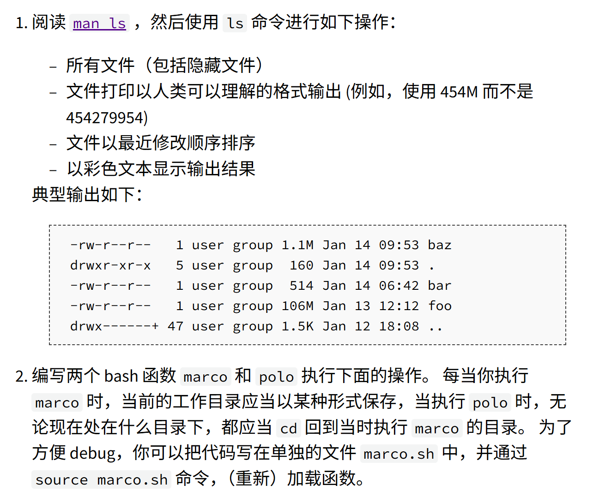
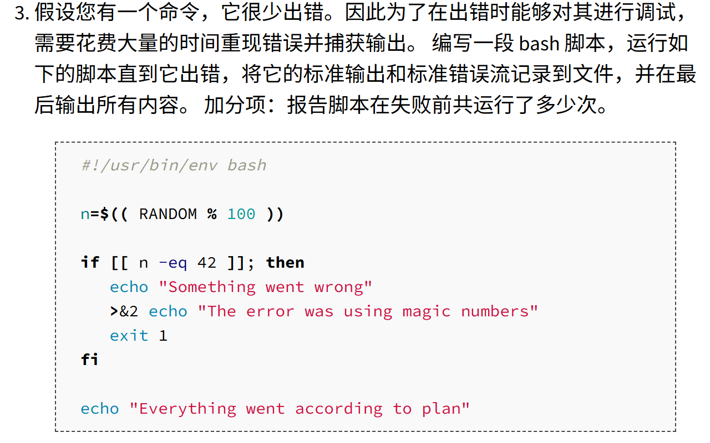

```bash
➜  ~ man ls
➜  ~ man ls | grep -i all
       List  information  about  the FILEs (the current directory by default).  Sort entries alphabetically if
       -a, --all
       -A, --almost-all
              print the allocated size of each file, in blocks
       -X     sort alphabetically by entry extension
       Written by Richard M. Stallman and David MacKenzie.
       or available locally via: info '(coreutils) ls invocation'
➜  ~ ls -a
.              .gitconfig   .python_history                    .zshrc
..             .ipython     .shell.pre-oh-my-zsh               ENTER
.bash_history  .landscape   .sudo_as_admin_successful          Homework
.bash_logout   .lesshst     .vscode                            Miniconda3-latest-Linux-x86_64.sh
.bashrc        .local       .vscode-server                     last-modified.txt
.cache         .motd_shown  .wget-hsts                         parallel
.conda         .nv          .zcompdump                         snap
.config        .oh-my-zsh   .zcompdump-tipsyscholar-5.8.1
.dotnet        .pki         .zcompdump-tipsyscholar-5.8.1.zwc
.fasd          .profile     .zsh_history
➜  ~ man ls | grep -i human
       -h, --human-readable
➜  ~ ls -lh
total 155M
drwxr-xr-x 19 tipsy tipsy 4.0K Sep 16 12:59 ENTER
drwxr-xr-x 10 tipsy tipsy 4.0K Nov  9 02:33 Homework
-rw-r--r--  1 tipsy tipsy 155M Aug 26 05:03 Miniconda3-latest-Linux-x86_64.sh
-rw-r--r--  1 tipsy tipsy   46 Nov 30 01:38 last-modified.txt
drwxr-xr-x  2 tipsy tipsy 4.0K Nov 29 23:01 parallel
drwx------  2 tipsy tipsy 4.0K Nov  7 17:14 snap
➜  ~ man ls | grep -i sort
       List  information  about  the FILEs (the current directory by default).  Sort entries alphabetically if
       none of -cftuvSUX nor --sort is specified.
       -c     with -lt: sort by, and show, ctime (time of last modification of file status information);  with
              -l: show ctime and sort by name; otherwise: sort by ctime, newest first
       -f     do not sort, enable -aU, disable -ls --color
              can be augmented with a --sort option, but any use of --sort=none (-U) disables grouping
              reverse order while sorting
       -S     sort by file size, largest first
       --sort=WORD
              sort by WORD instead of name: none (-U), size (-S), time (-t), version (-v), extension (-X)
              with -l, WORD determines which time to show; with --sort=time, sort by WORD (newest first)
       -t     sort by time, newest first; see --time
       -u     with -lt: sort by, and show, access time; with -l: show access time and sort by name; otherwise:
              sort by access time, newest first
       -U     do not sort; list entries in directory order
       -v     natural sort of (version) numbers within text
       -X     sort alphabetically by entry extension
➜  ~ ls -lt
total 158352
-rw-r--r--  1 tipsy tipsy        46 Nov 30 01:38 last-modified.txt
drwxr-xr-x  2 tipsy tipsy      4096 Nov 29 23:01 parallel
drwxr-xr-x 10 tipsy tipsy      4096 Nov  9 02:33 Homework
drwx------  2 tipsy tipsy      4096 Nov  7 17:14 snap
drwxr-xr-x 19 tipsy tipsy      4096 Sep 16 12:59 ENTER
-rw-r--r--  1 tipsy tipsy 162129736 Aug 26 05:03 Miniconda3-latest-Linux-x86_64.sh
➜  ~ man ls | grep -i color
       --color[=WHEN]
              colorize  the  output;  WHEN can be 'always' (default if omitted), 'auto', or 'never'; more info
       -f     do not sort, enable -aU, disable -ls --color
       Using color to distinguish file types is  disabled  both  by  default  and  with  --color=never.   With
       --color=auto, ls emits color codes only when standard output is connected to a terminal.  The LS_COLORS
       environment variable can change the settings.  Use the dircolors command to set it.
➜  ~ ls -l --color
total 158352
drwxr-xr-x 19 tipsy tipsy      4096 Sep 16 12:59 ENTER
drwxr-xr-x 10 tipsy tipsy      4096 Nov  9 02:33 Homework
-rw-r--r--  1 tipsy tipsy 162129736 Aug 26 05:03 Miniconda3-latest-Linux-x86_64.sh
-rw-r--r--  1 tipsy tipsy        46 Nov 30 01:38 last-modified.txt
drwxr-xr-x  2 tipsy tipsy      4096 Nov 29 23:01 parallel
drwx------  2 tipsy tipsy      4096 Nov  7 17:14 snap

➜  ~ macro(){
echo $(pwd) > ~/macro.txt
}
➜  ~ polo(){
cd  "$(cat ~/macro.txt)"
}
➜  ~ macro
➜  ~ cd ...
➜  / polo
➜  ~
```

```bash
➜  ~ nano ~/test.sh
➜  ~ cat ~/test.sh
 #!/usr/bin/env bash

 n=$(( RANDOM % 100 ))

 if [[ n -eq 42 ]]; then
    echo "Something went wrong"
    >&2 echo "The error was using magic numbers"
    exit 1
 fi

 echo "Everything went according to plan"
➜  ~ chmod u+x ~/test.sh
➜  ~ ls -l
total 158368
drwxr-xr-x 19 tipsy tipsy      4096 Sep 16 12:59 ENTER
drwxr-xr-x 10 tipsy tipsy      4096 Nov  9 02:33 Homework
-rw-r--r--  1 tipsy tipsy 162129736 Aug 26 05:03 Miniconda3-latest-Linux-x86_64.sh
-rw-r--r--  1 tipsy tipsy        46 Nov 30 01:38 last-modified.txt
-rw-r--r--  1 tipsy tipsy        25 Nov 30 05:32 macro
-rw-r--r--  1 tipsy tipsy        57 Nov 30 05:29 macro.sh
-rw-r--r--  1 tipsy tipsy        12 Nov 30 05:39 macro.txt
drwxr-xr-x  2 tipsy tipsy      4096 Nov 29 23:01 parallel
drwx------  2 tipsy tipsy      4096 Nov  7 17:14 snap
-rwxr--r--  1 tipsy tipsy       210 Nov 30 05:41 test.sh
➜  ~ nano ~/problem3.sh
➜  ~ cat ~/problem3.sh
#!/usr/bin/env bash
n=0
while :;do
        temp=$(bash ~/test.sh 2>&1)
        if [[ "$temp" == *"The error was using magic numbers"*  ]];then
                echo "$temp" >> ~/log.txt
                break
        fi
        echo "$temp" >> ~/log.txt
        n=$((n+1))
done

echo "${n}" >> ~/log.txt
cat ~/log.txt
rm ~/log.txt
➜  ~ chmod u+x problem3.sh
➜  ~ bash problem3.sh
Everything went according to plan
Something went wrong
The error was using magic numbers
1
➜  ~ bash problem3.sh
Everything went according to plan
Everything went according to plan
Everything went according to plan
Everything went according to plan
Everything went according to plan
Everything went according to plan
Everything went according to plan
Everything went according to plan
Everything went according to plan
Everything went according to plan
Everything went according to plan
Everything went according to plan
Everything went according to plan
Everything went according to plan
Everything went according to plan
Everything went according to plan
Everything went according to plan
Everything went according to plan
Everything went according to plan
Everything went according to plan
Everything went according to plan
Everything went according to plan
Everything went according to plan
Everything went according to plan
Everything went according to plan
Everything went according to plan
Everything went according to plan
Everything went according to plan
Everything went according to plan
Everything went according to plan
Everything went according to plan
Everything went according to plan
Everything went according to plan
Everything went according to plan
Everything went according to plan
Everything went according to plan
Everything went according to plan
Everything went according to plan
Everything went according to plan
Everything went according to plan
Everything went according to plan
Everything went according to plan
Everything went according to plan
Everything went according to plan
Everything went according to plan
Everything went according to plan
Everything went according to plan
Everything went according to plan
Everything went according to plan
Everything went according to plan
Everything went according to plan
Everything went according to plan
Everything went according to plan
Everything went according to plan
Everything went according to plan
Everything went according to plan
Everything went according to plan
Everything went according to plan
Everything went according to plan
Everything went according to plan
Everything went according to plan
Everything went according to plan
Everything went according to plan
Everything went according to plan
Everything went according to plan
Everything went according to plan
Everything went according to plan
Everything went according to plan
Everything went according to plan
Everything went according to plan
Everything went according to plan
Everything went according to plan
Everything went according to plan
Everything went according to plan
Everything went according to plan
Everything went according to plan
Everything went according to plan
Everything went according to plan
Everything went according to plan
Everything went according to plan
Everything went according to plan
Everything went according to plan
Everything went according to plan
Everything went according to plan
Everything went according to plan
Everything went according to plan
Everything went according to plan
Everything went according to plan
Everything went according to plan
Everything went according to plan
Everything went according to plan
Everything went according to plan
Everything went according to plan
Everything went according to plan
Everything went according to plan
Everything went according to plan
Everything went according to plan
Everything went according to plan
Everything went according to plan
Everything went according to plan
Everything went according to plan
Everything went according to plan
Everything went according to plan
Everything went according to plan
Everything went according to plan
Everything went according to plan
Everything went according to plan
Everything went according to plan
Everything went according to plan
Everything went according to plan
Everything went according to plan
Everything went according to plan
Everything went according to plan
Everything went according to plan
Everything went according to plan
Everything went according to plan
Everything went according to plan
Everything went according to plan
Everything went according to plan
Everything went according to plan
Everything went according to plan
Everything went according to plan
Everything went according to plan
Everything went according to plan
Everything went according to plan
Everything went according to plan
Something went wrong
The error was using magic numbers
126
➜  ~
```

```bash


```